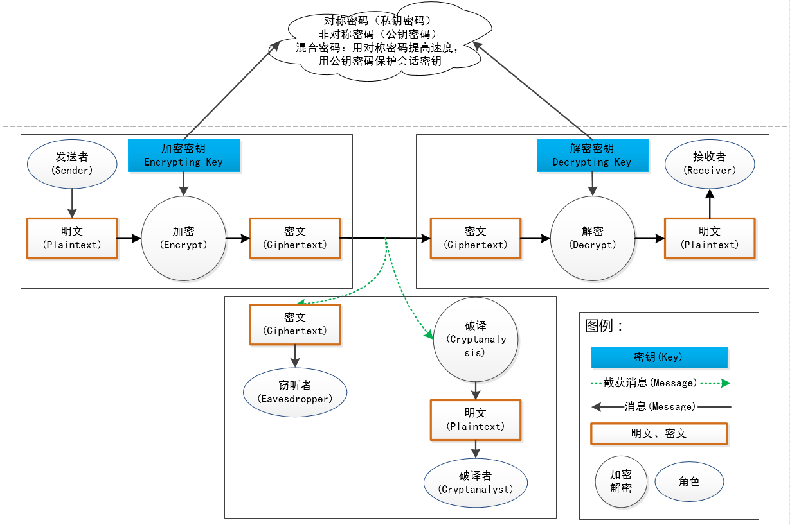
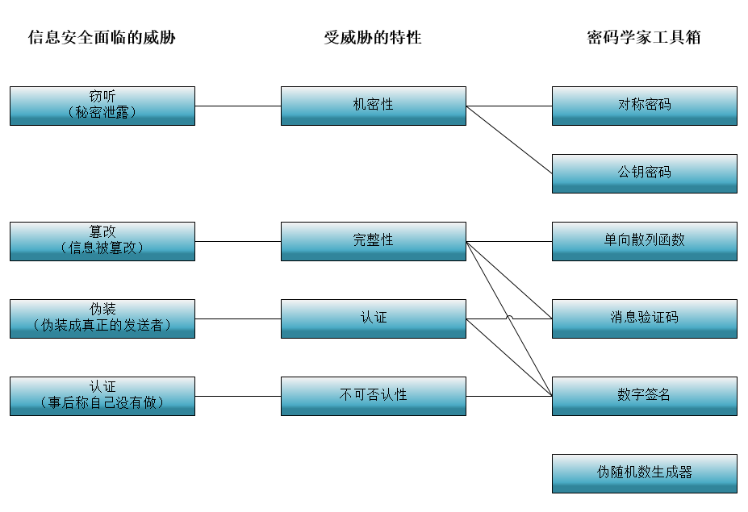
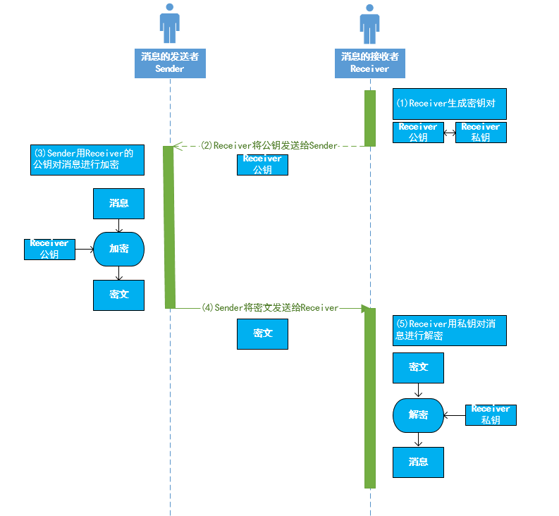

# 1 环游密码世界

## 1.1 密码

## 1.2 对称密码和公钥密码
    对称密码（私钥密码）：加密解密同一密钥
    公钥密码（非对称密码）：加密解密不同密钥
    混合密码：结合对称密码和公钥密码

## 1.3 密码学家的工具箱

# 2 历史上的密码-写一篇别人看不懂的文章

## 2.1 密码种类：
    凯撒密码
    简单替换密码
    Enigma（德国纳粹）：密码算法和密钥分开。密钥加密密钥（Key Encrypting Key，KEK）
## 2.2 破解工具：
    暴力攻击
    频率分析

# 3 对称密码（共享密钥密码）-用相同的密钥进行加密和解密

将现实中的东西映射为比特序列的操作叫编码（encoding）。

XOR（exclusive or）异或。

## 3.1 算法/模式/补码方式

### 3.1.1 对称加密算法
    一次性密码本one-time pad—不会被破译的密码
    DES （data encryption standard，56比特）
    DESede （triple DES，168比特）-目前被银行机构使用
    AES（advanced encryption standard，128、192、256比特）-方向
    PBE（Password Based Encryption）对已有算法的包装 - 基于口令加密
    IDEA 用于邮件加密，避开美国法律限制 – 国产

### 3.1.2 对称加密模式
    ECB---Electronic Codebook block mode(项目中常用)
    OFB---Output Feedback block mode
    CTRGladman---Counter block mode compatible with  Dr Brian Gladman fileenc.c
    CTR---Counter block mode
    CFB---Cipher Feedback block mode

### 3.1.3 对称加密补码方式
    Pkcs7---PKCS #5/7 padding strategy(项目中常用)
    AnsiX923---ANSI X.923 padding strategy
    Iso10126---ISO 10126 padding strategy
    Iso97971---ISO/IEC 9797-1 Padding Method 2
    NoPadding---A noop padding strategy
    ZeroPadding---Zero padding strategy

# 4 分组密码
略

# 5 公钥密码-用公钥加密，用私钥解密
RSA三个作者姓首字母

# 6 混合密码系统-用对称密码提高速度，用公钥密码保护会话密钥
    类似油电混合汽车
    解决对称密码中密钥传输问题。

# 7 单向散列函数-获取消息的“指纹”

单向散列函数（one-way hash function）：输入为消息（message）或者叫原像（pre-image）、输出为散列值（hash value）或者叫信息摘要（message digest）或者叫指纹（fingerprint）。

单向散列函数也成为信息摘要（message digest function）函数、哈希函数（hash function）或者杂凑函数。

Hash，原意古法语的“斧子”，后来引申为“剁碎的肉”，也许用斧子一通乱剁再搅在一起的那种感觉吧。

## 7.1 单向散列函数的性质

根据任意长度的消息计算出固定长度的散列值

能够快速计算出散列值

消息不同散列值也不同

两个不同的消息产生同一个散列值的情况为碰撞（collision）。

难以发现碰撞的性质称为抗碰撞性（collision resistance）。

具备单向性。

## 7.2 单向散列函数的实际作用

检测软件是否被篡改

基于口令的密码

基于口令的加密（password base encryption，PBE）：口令+盐（salt）

消息认证码

数字签名

伪随机数生成器

一次性口令 one-time password

## 7.3 单向散列函数的具体列子

### 7.3.1 MD4、MD5

MD是消息摘要（Message Digest），它们都不安全了。

### 7.3.2 SHA-1、SHA-256、SHA-384、SHA-512

SHA-1已经不安全了，SHA-2还尚未被攻破。

### 7.3.3 RIPEMD-160

RIPEMD已经被攻破，但RIPEMD-160还尚未被攻破。

### 7.3.4 AHS（Advanced Hash Standard）与SHA-3

方向。

